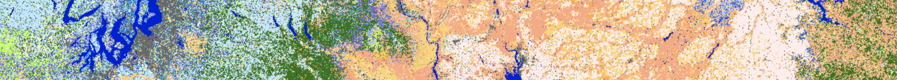

# `@firestarter.io/fuelmodels`

Constants and parameters for Anderson's 13 Fuel Models and Scott &amp; Burgan's 40 Fuel Models



## What this is

Mathematical predictions of wildfire depend on characteristics of various fuel models. The two most popular fuel models in use today for wildfire prediction are Aderson's 13 fuel models, and Scott & Burgan's 40 fuel models. This small package provides values and descriptions for the various characteristics of these 53 fuel models. These constants can be used in conjuntion with [LANDFIRE ArcGIS server layers](https://landfire.cr.usgs.gov/arcgis/rest/services/Landfire/US_200/MapServer) specifically [FBFM13](https://landfire.cr.usgs.gov/arcgis/rest/services/Landfire/US_200/MapServer/19) and [FBFM40](https://landfire.cr.usgs.gov/arcgis/rest/services/Landfire/US_200/MapServer/10).

## Install and Use

```
npm install @firestarter/fuelmodels
```

```ts
import { FBFM13, FBFM40 } from '@firestarter/fuelmodels';
```

Fuel model characteristics are also available in JSON format:

```ts
import FBFM13 from '@firestarter/fuelmodels/dist/FBFM14.json';
```

## Data Sources

Data is primarily sourced from [The Rothermel surface fire spread model and associated developments: A comprehensive explanation, Patricia L Andrews, United States Forest Service, 2018](https://www.fs.usda.gov/treesearch/pubs/55928)

Additional characteristics are also sourced for the original texts:

- [Aids to Determining Fuel Models For Estimating Fire Behavior, Hal E. Anderson, 1982](https://www.fs.fed.us/rm/pubs_int/int_gtr122.pdf)
- [Standard Fire Behavior Fuel Models: A Comprehensive Set for Use with Rothermel’s Surface Fire Spread Model, Scott & Burgan, 2005](https://www.fs.fed.us/rm/pubs/rmrs_gtr153.pdf)

## Schema

The data structure of the fuel models objects can be found in `@firestarter/fuelmodels/dist/FuelModels.d.ts`. For quick reference, here is a copy of that file:

```ts
/**
 * Interface describing a fuel model.  Forms basis of FuelModel13 and FuelModel40 interfaces
 */
export interface FuelModel {
	/**
	 * The code label for the fuel type, matches value for the key referencing the FuelModel
	 */
	label: string;
	/**
	 * The name / title of the fuel type
	 */
	name?: string;
	/**
	 * String description of the fuel model
	 */
	description?: string;
	/**
	 * Fuel loading in tons / acre
	 */
	fuelLoading: {
		/**
		 * In 1 hour period
		 */
		oneHour: number;
		/**
		 * In 10 hour period
		 */
		tenHour: number;
		/**
		 * In 100 hour period
		 */
		hundredHour: number;
		/**
		 * Live herbaceous load is the value before dynamic fuel model load transfer to dead herbaceous
		 */
		liveHerbaceous: number;
		/**
		 * Live woody fuel loading
		 */
		liveWoody: number;
	};
	/**
	 * Surface-area-to-volume ratios, in ft^2/ft^3
	 */
	sav: {
		/**
		 * Characteristic Surface-area-to-volume ratio
		 */
		characteristic: number;
		/**
		 * Surface-area-to-volume ratio for 1 hour time lag
		 */
		oneHour: number;
		/**
		 * Surface-area-to-volume ratio for live and dead herbaceous fuel
		 */
		liveAndDeadHerbaceous?: number;
		/**
		 * Surface-area-to-volume ratio for woody fuel
		 */
		liveWoody?: number;
	};
	/**
	 * Depth of fuel bed, in feet
	 */
	fuelBedDepth: number;
	/**
	 * The fuel moisture content, as a percent, weighed over all the fuel classes,
	 * at which the fire will not spread. Also called extinction moisture content
	 */
	moistureOfExtinction: number;
	/**
	 * Bulk density, in lb/ft^2
	 */
	bulkDensity: number;
	/**
	 * Nonburnable status for nonburnable fuel types
	 */
	nonBurnable?: true;
	/**
	 * Relative packing ratio is a unitless ratio
	 *
	 * From [The Rothermel surface fire spread model and associated developments: A comprehensive explanation, 2018](https://www.fs.usda.gov/treesearch/pubs/55928)
	 */
	relativePackingRatio: number;
}
```

FBFM13 has the additional property:

```ts
/**
 * Rate of spread, in chains / hour, assuming windspeed of 5 mi/h (8 km/h)
 * and moisture content of 8%.  1 chain per hour ~= 1.1 foot per minute or ~ 18 meters/hour
 *
 * Drawn directly from [Aids to Determining Fuel Models For Estimating Fire Behavior, Hal E. Anderson, 1982](https://www.fs.fed.us/rm/pubs_int/int_gtr122.pdf).
 */
rateOfSpread: number;
```

And FMFB40 has the additional property:

```ts
/**
 * Packing ratio is a unitless ratio
 *
 * From [Standard Fire Behavior Fuel Models: A Comprehensive Set for Use with Rothermel’s Surface Fire Spread Model, Scott & Burgan, 2005](https://www.fs.fed.us/rm/pubs/rmrs_gtr153.pdf)
 */
packingRatio: number;
```
